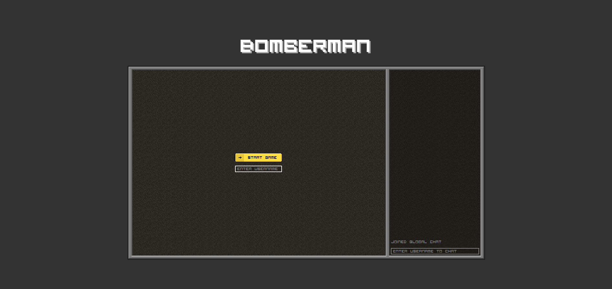
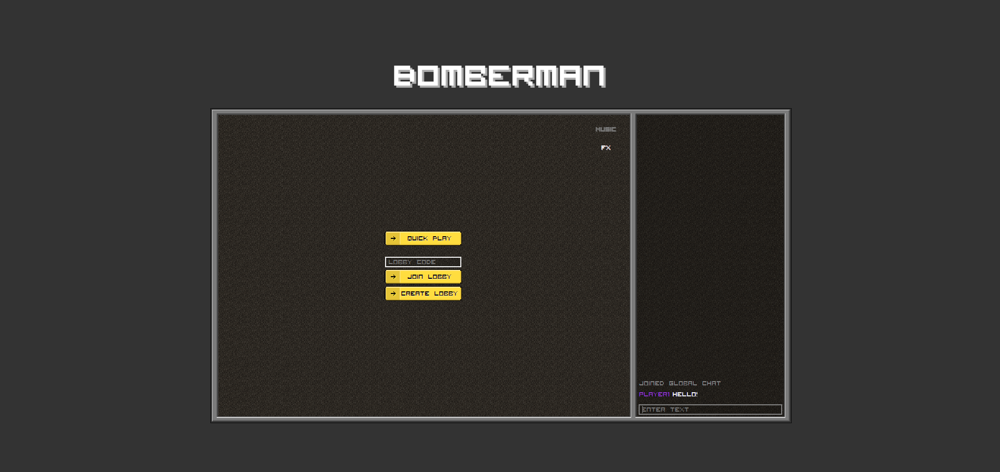
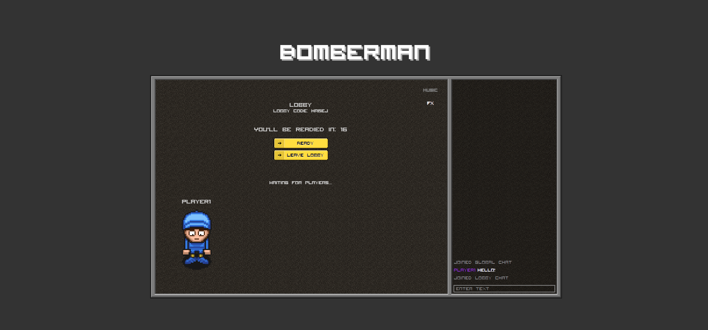
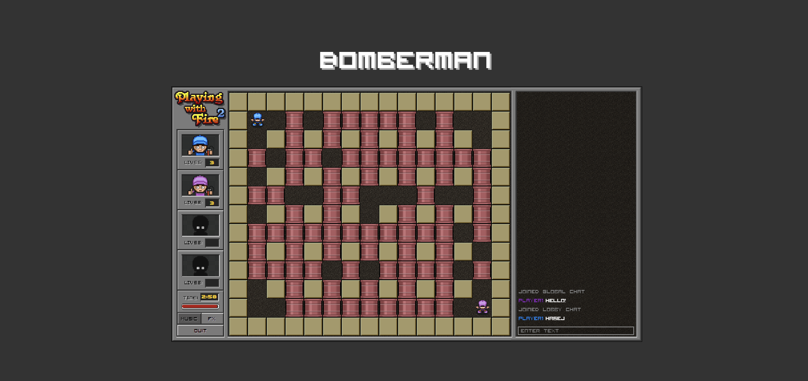
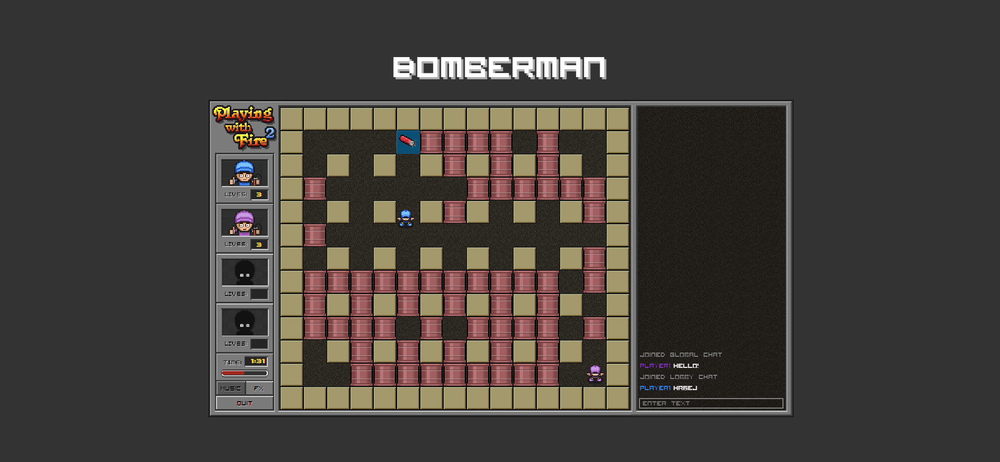
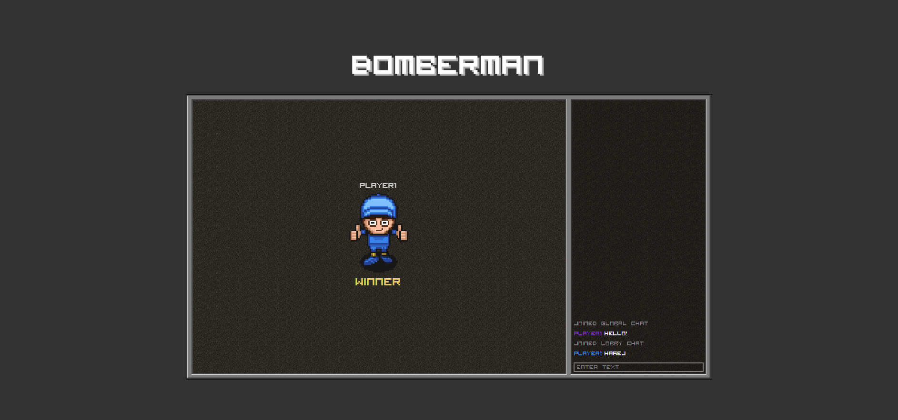

<!-- ctrl + shift + v to preview -->
# Bomberman

## Table of Contents
- [Bomberman](#bomberman)
  - [Table of Contents](#table-of-contents)
  - [General Information](#general-information)
  - [Features](#features)
  - [Technologies Used](#technologies-used)
  - [Team \& My Work](#team--my-work)
  - [Main Learnings](#main-learnings)
  - [Setup](#setup)
  - [Images](#images)

## General Information
This project was made as a school project in [kood/Jõhvi](https://kood.tech/) (12.10.2022)

The project required us to recreate a popular legacy game called Bomerman or in other name Playing with Fire 2. 

One of the limitations was to use our own web framework called [Mist.js](https://github.com/JesusKris/web-framework).

  **NB! Different source control platform was used hence no commit history.**
  
## Features
- Global & lobby chats
- Original assets & sounds
- Lobby creation and joining lobbies via code

## Technologies Used
[TypeScript](https://www.typescriptlang.org/)

[Golang](https://go.dev/)

[Vite](https://vitejs.dev/)

[Mist.js](https://github.com/JesusKris/web-framework)

## Team & My Work
In this project I was in a team of 4 with 3 other students from kood/Jõhvi.

I was responsible for:
  - The overall lifecycle of the game
  - UI/UX Design
  - Making the main game loop
  - Source code structure
  - A lot of the client side TS models
  - Project management

## Main Learnings
- TypeScript Classes, OOP
- Structured source code
- Real-time multiplayer game architecture
- CSS animations
- Vite bundler
- Effective project management

## Setup
Clone the repository
```
git clone https://github.com/JesusKris/bomberman.git
```

Rename .env-example files to .env and fill them up as expected in both client & server

Open two terminals

Navigate to ./src/client on one of them
```bash
cd /src/client
```
Install node modules
```
npm install --omit=dev
```
Run a Vite server
```
npm run dev
```
Navigate to ./src/server on the other

```bash
cd /src/server
```
Start a Golang server
```
go run server.go
```


## Images





